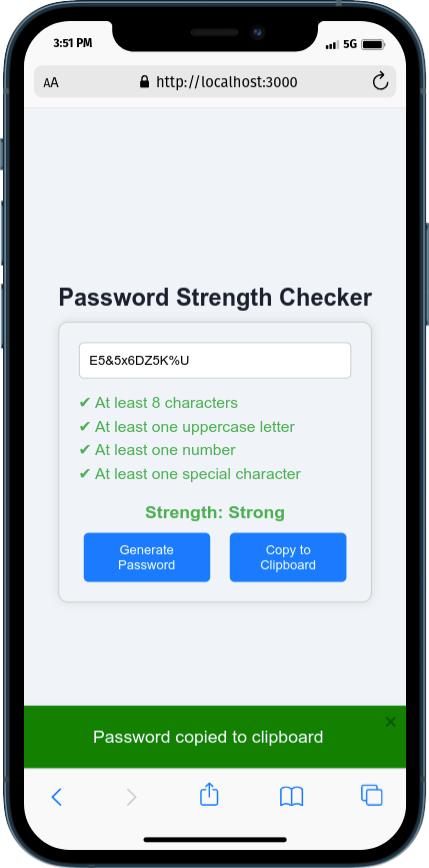

# Password Strength Checker

This is a simple Password Strength Checker web application built using Next.js. It allows users to input a password and checks its strength based on certain criteria. The application also includes features to generate a strong password and copy it to the clipboard.



## Features

- **Password Strength Evaluation**: Checks if the password meets the criteria for being weak, medium, or strong.
- **Password Generation**: Generates a random strong password.
- **Copy to Clipboard**: Allows users to copy the generated password to the clipboard.
- **Responsive Design**: The application is responsive and works well on different screen sizes.

## Technologies Used

- [Next.js](https://nextjs.org/) - A React framework for server-side rendering and static site generation.
- CSS - For styling the application.

## Installation

1. **Clone the repository:**

   ```bash
   git clone https://github.com/maruf-pfc/password-strength-checker.git
   cd password-strength-checker
   ```

2. **Install dependencies:**

   ```bash
   npm install
   ```

3. **Run the development server:**

   ```bash
   npm run dev
   ```

4. **Open your browser and visit:**

   ```
   http://localhost:3000
   ```

## Usage

- Enter a password in the input field to check its strength.
- Click the "Generate Password" button to create a strong password.
- Click the "Copy to Clipboard" button to copy the generated password.

## Project Structure

- `components/PasswordStrengthChecker.js`: Contains the main logic for checking password strength and generating passwords.
- `globals.css`: Contains the CSS styles for the application.
- `pages/index.js`: The main page that renders the Password Strength Checker component.

## License

This project is licensed under the MIT License. See the [LICENSE](LICENSE) file for details.

## Acknowledgments

- Thanks to the Next.js team for creating such a powerful framework.
